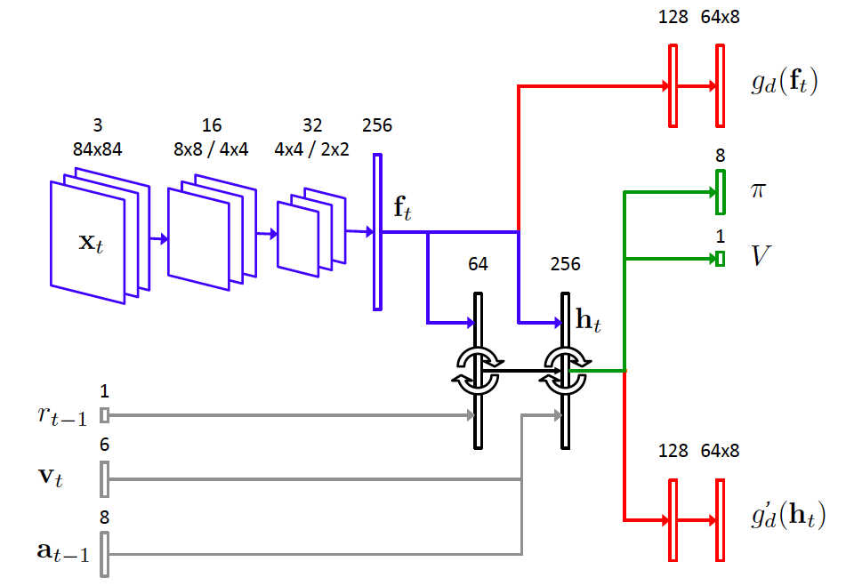
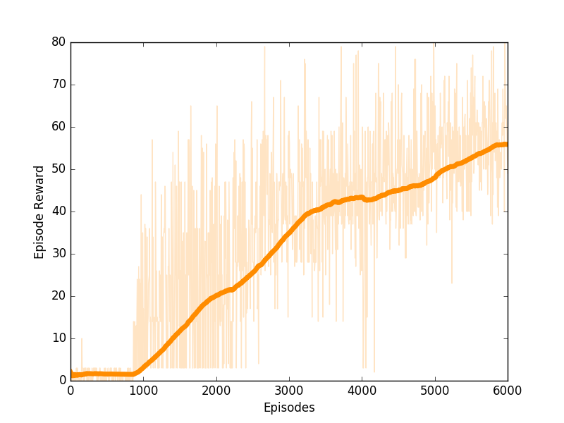
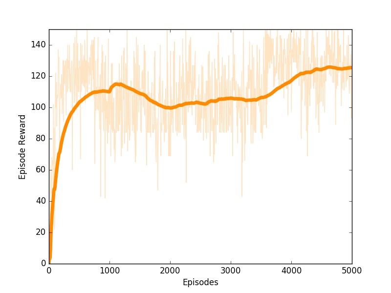

# Maze Navigation using Reinforcement Learning

## Description

TensorFlow implementation of ideas in the DeepMind paper ["Learning to Navigate in Complex Environments"](https://arxiv.org/abs/1611.03673). The baseline architecture is GPU-based A3C from the paper ["Reinforcement Learning through Asynchronous Advantage Actor-Critic on a GPU"](https://openreview.net/forum?id=r1VGvBcxl)

## Requirements

* TensorFlow 1.0
* DeepMind Lab
* Python plugins - numpy, cv2, pygame

## Getting Started

Dowload and install DeepMind Lab
```
$ git clone https://github.com/deepmind/lab.git
```
Build it following the [build instructions](https://github.com/deepmind/lab/blob/master/docs/build.md)

Clone repo **inside** the lab directory
```
$ cd lab
$ git clone https://github.com/tgangwani/GA3C-DeepNavigation.git
```
Add the bazel instructions at the end of lab/BUILD file

```
py_binary(
    name = "GA3C-DeepNavigation_train",
    srcs = ["GA3C-DeepNavigation/GA3C.py"],
    data = [":deepmind_lab.so"],
    main = "GA3C-DeepNavigation/GA3C.py",
)
```

Then run bazel command to run the agent 
```
bazel run :GA3C-DeepNavigation_train --define headless=osmesa
```
Use ```PLAY_MODE=False``` in Config.py for training. 
Setting ```PLAY_MODE=True``` loads model parameters from a 
checkpoint and runs a single agent. A display is expected.

## Network
The neural net architecture is the same as in the paper, **but for the
loop-prediction loss**.



## Results 

### 1. Nav_maze_static_01

#### Live Agent 
[YouTube](https://www.youtube.com/watch?v=vyS0Z7wdHHs)

#### Learning Curve


### 2. Stairway to melon

#### Live Agent 
[YouTube](https://www.youtube.com/watch?v=0R5MGM7VPo4)

#### Learning Curve



## Acknowledgement 
[Unreal code by miyosuda](https://github.com/miyosuda/unreal)
